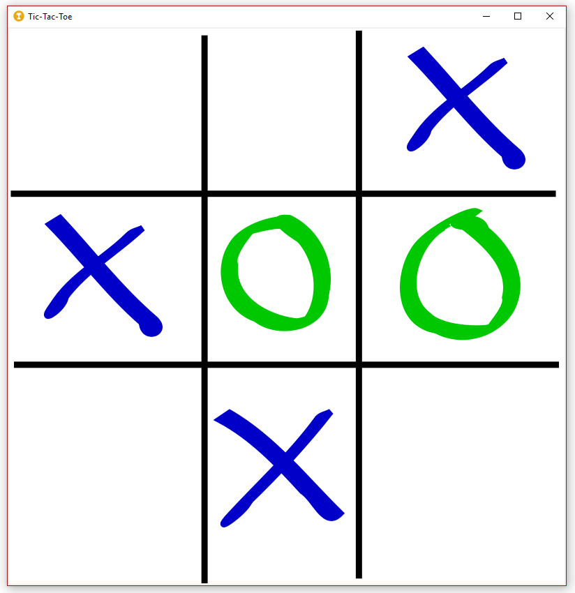
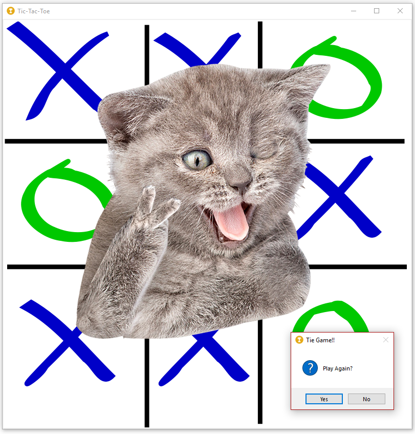
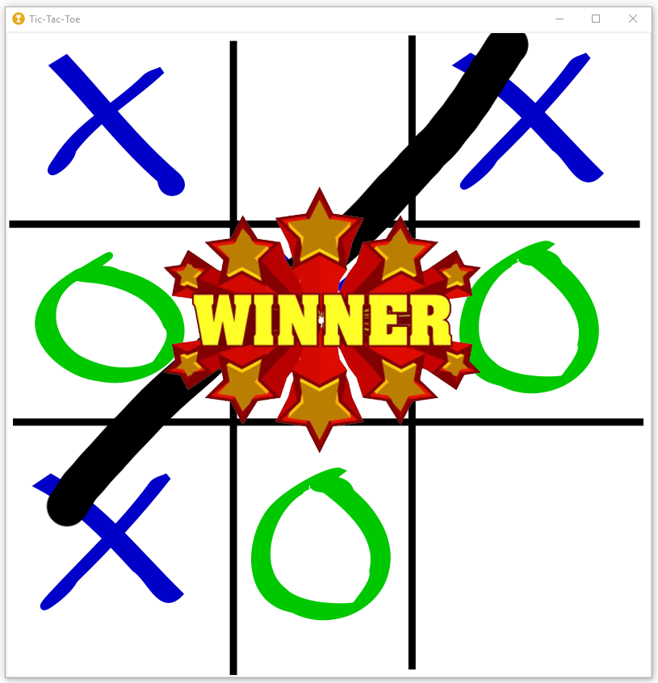

# Tic-Tac-Toe
A simple point-and-click **Tic Tac Toe** game built with Tkinter  

This program works by painting images on a canvas. Click events assign an X or Y image to the location nearest to a center XY coordinate in the game grid.  

A few interesting features include:
- randomly select X and Y images to add variety
- change cursor to "X" or "O" based on user turn
- popup message box asks user to play again

  

  

